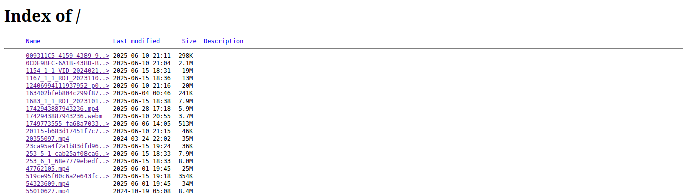

**`FancyIndexing`** adalah opsi di Apache `mod_autoindex` yang membuat tampilan daftar file (autoindex) menjadi **lebih kaya dan informatif**.

Kalau `autoindex` itu seperti "menampilkan isi folder", maka `FancyIndexing` itu seperti "memberi gaya dan detail tambahan pada tampilan folder tersebut".

---

### ✨ Fitur `FancyIndexing`

Ketika `FancyIndexing` aktif, halaman index direktori akan menyertakan:

| Fitur                                  | Penjelasan                                                                                       |
| -------------------------------------- | ------------------------------------------------------------------------------------------------ |
| **Ikon**                               | Gambar kecil mewakili jenis file (misalnya ikon dokumen, folder, gambar)                         |
| **Ukuran file (Size)**                 | Menampilkan ukuran setiap file                                                                   |
| **Tanggal modifikasi (Last Modified)** | Menampilkan tanggal & waktu terakhir file diubah                                                 |
| **Kolom yang bisa diurutkan**          | Biasanya header kolom bisa diklik untuk mengurut berdasarkan nama, ukuran, dll (jika diaktifkan) |
| **CSS bawaan Apache**                  | Memberi tampilan tabel yang rapi dan lebih mudah dibaca                                          |

---

### 📄 Contoh perbandingan

#### 🔹 Tanpa `FancyIndexing` (sederhana):


#### 🔹 Dengan `FancyIndexing`:



---

### 🔧 Cara mengaktifkan atau menonaktifkan

Di konfigurasi Apache (`.htaccess` atau `apache2.conf`):

```apache
Options +Indexes
IndexOptions +FancyIndexing
```

Untuk menonaktifkan:

```apache
IndexOptions -FancyIndexing
```

---

### ⚠️ Efek ke performa

`FancyIndexing` **membaca lebih banyak metadata per file** dan menambahkan ikon. Maka:

* Bisa **menambah beban CPU/disk I/O** kalau direktori besar,
* Membuat halaman index jadi **lebih lambat di-load**, terutama di server lemah atau direktori ribuan file,
* **Tidak disarankan** di server publik yang melayani banyak permintaan autoindex.

---

### ✅ Kapan pakai?

| Gunakan `FancyIndexing` jika...         | Hindari `FancyIndexing` jika...                        |
| --------------------------------------- | ------------------------------------------------------ |
| Direktori kecil dan untuk akses manusia | Direktori besar, server lambat, atau untuk bot/crawler |
| Butuh tampilan rapi dan informatif      | Ingin kecepatan dan efisiensi maksimal                 |
| Tidak ada halaman `index.html` buatan   | Sudah punya halaman sendiri                            |

---

Kalau kamu hanya butuh daftar file sederhana dan cepat, sebaiknya **nonaktifkan `FancyIndexing`**.
