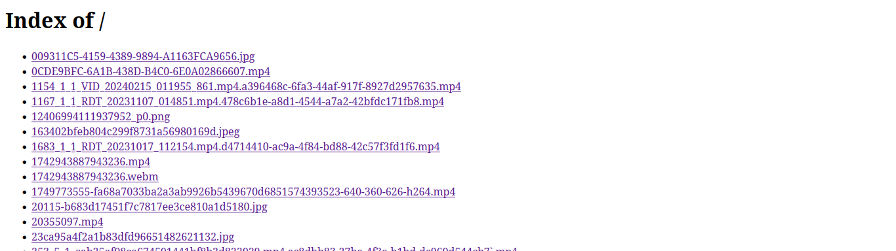

**`FancyIndexing`** adalah opsi di Apache `mod_autoindex` yang membuat tampilan daftar file (autoindex) menjadi **lebih kaya dan informatif**.

Kalau `autoindex` itu seperti "menampilkan isi folder", maka `FancyIndexing` itu seperti "memberi gaya dan detail tambahan pada tampilan folder tersebut".

---

### ✨ Fitur `FancyIndexing`

Ketika `FancyIndexing` aktif, halaman index direktori akan menyertakan:

| Fitur                                  | Penjelasan                                                                                       |
| -------------------------------------- | ------------------------------------------------------------------------------------------------ |
| **Ikon**                               | Gambar kecil mewakili jenis file (misalnya ikon dokumen, folder, gambar)                         |
| **Ukuran file (Size)**                 | Menampilkan ukuran setiap file                                                                   |
| **Tanggal modifikasi (Last Modified)** | Menampilkan tanggal & waktu terakhir file diubah                                                 |
| **Kolom yang bisa diurutkan**          | Biasanya header kolom bisa diklik untuk mengurut berdasarkan nama, ukuran, dll (jika diaktifkan) |
| **CSS bawaan Apache**                  | Memberi tampilan tabel yang rapi dan lebih mudah dibaca                                          |

---

### 📄 Contoh perbandingan

#### 🔹 Tanpa `FancyIndexing` (sederhana):



#### 🔹 Dengan `FancyIndexing`:


---

## 🔧 Cara mengaktifkan atau menonaktifkan (bisa dipilih salah satu)


### 1. **Di file konfigurasi utama Apache**

Biasanya:

* Ubuntu/Debian: `/etc/apache2/apache2.conf`
* CentOS/RHEL: `/etc/httpd/conf/httpd.conf`

Contoh:

```apache
<Directory /var/www/html/videos>
    Options +Indexes
    IndexOptions +FancyIndexing
</Directory>
```

Untuk menonaktifkan:

```apache
<Directory /var/www/html/videos>
    Options -Indexes
</Directory>
```

---

### 2. **Di file konfigurasi virtual host**

Biasanya terletak di:

* `/etc/apache2/sites-available/000-default.conf` (Ubuntu)
* Atau `conf.d/vhost.conf` tergantung distro

Contoh:

```apache
<VirtualHost *:80>
    DocumentRoot /var/www/html

    <Directory /var/www/html/videos>
        Options +Indexes
        IndexOptions +FancyIndexing
    </Directory>
</VirtualHost>
```

---

### 3. **Di file `.htaccess`** (jika `AllowOverride` diaktifkan)

Kamu bisa langsung menulis di folder target:

`.htaccess` di `/var/www/html/videos`:

```apache
Options +Indexes
IndexOptions +FancyIndexing
```

Untuk menonaktifkan:

```apache
Options -Indexes
```

> ⚠️ File `.htaccess` hanya berfungsi jika diaktifkan dengan:

```apache
AllowOverride All
```

pada konfigurasi `Directory`.

---

Setelah mengubah konfigurasi, **jangan lupa restart Apache:**

```bash
sudo systemctl restart apache2
```

atau

```bash
sudo service apache2 restart
```

---

### ⚠️ Efek ke performa

`FancyIndexing` **membaca lebih banyak metadata per file** dan menambahkan ikon. Maka:

* Bisa **menambah beban CPU/disk I/O** kalau direktori besar,
* Membuat halaman index jadi **lebih lambat di-load**, terutama di server lemah atau direktori ribuan file,
* **Tidak disarankan** di server publik yang melayani banyak permintaan autoindex.

---

### ✅ Kapan pakai?

| Gunakan `FancyIndexing` jika...         | Hindari `FancyIndexing` jika...                        |
| --------------------------------------- | ------------------------------------------------------ |
| Direktori kecil dan untuk akses manusia | Direktori besar, server lambat, atau untuk bot/crawler |
| Butuh tampilan rapi dan informatif      | Ingin kecepatan dan efisiensi maksimal                 |
| Tidak ada halaman `index.html` buatan   | Sudah punya halaman sendiri                            |

---

Kalau kamu hanya butuh daftar file sederhana dan cepat, sebaiknya **nonaktifkan `FancyIndexing`**.
